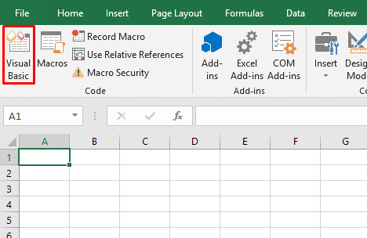
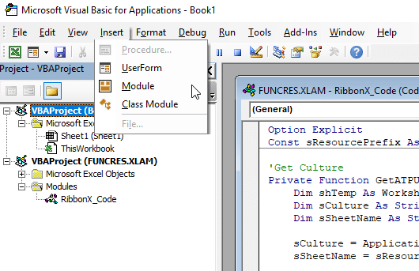
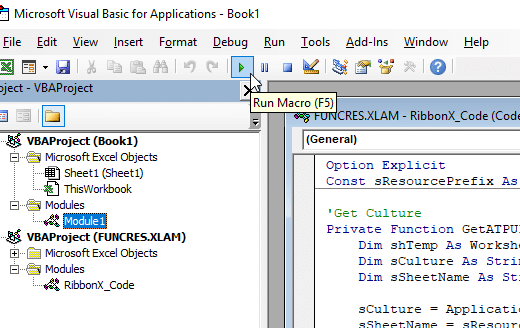

# Excel Break Password
Basic code to break excel password

Before you start coding, you’ll need to open the VBA editor. To do this, head to the Developer tab and click the Visual Basic button:



If you don’t see the Developer tab, go to **File > Options > Customize Ribbon** and make sure that **“Developer”** is checked in the right panel.

You can also open the VBA editor with the keyboard shortcut **Alt + F11**.

### Microsoft Visual Basic
To add a new, empty module, click on Modules folder, and go to **Insert > Module**.



After window pops out, insert the code that in this repository
```basic
Sub BreakPassword()

   Dim i As Integer, j As Integer, k As Integer
   Dim l As Integer, m As Integer, n As Integer
   Dim i1 As Integer, i2 As Integer, i3 As Integer
   Dim i4 As Integer, i5 As Integer, i6 As Integer

   On Error Resume Next

   For i = 65 To 66: For j = 65 To 66: For k = 65 To 66
   For l = 65 To 66: For m = 65 To 66: For i1 = 65 To 66
   For i2 = 65 To 66: For i3 = 65 To 66: For i4 = 65 To 66
   For i5 = 65 To 66: For i6 = 65 To 66: For n = 32 To 126

   ActiveSheet.Unprotect Chr(i) & Chr(j) & Chr(k) & _
   Chr(l) & Chr(m) & Chr(i1) & Chr(i2) & Chr(i3) & _
   Chr(i4) & Chr(i5) & Chr(i6) & Chr(n)

   If ActiveSheet.ProtectContents = False Then
      Exit Sub
   End If

   Next: Next: Next: Next: Next: Next
   Next: Next: Next: Next: Next: Next

End Sub
```

Then you need to just run the macro, just click the **Run Macro** button in the menu bar:



You can also press **F5** on your keyboard.

After that your password should be resetted now
